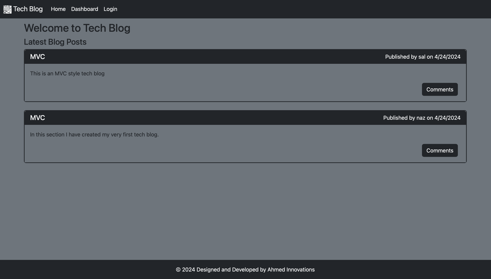

# Challenge 14

## Tech Blog

In this project, I have created a blog for tech related articles. I want user to be able to sign up and login using their username and password. If a user isnt signed in I want do not want the user to have access to certain data. In the dashboard page, if the user is not logged in they cannot view the page. Also if the user doesnt have any post they cannot access other users posts.

## Link

https://tech-blog-2w3g.onrender.com/

### Preview of Web Application

